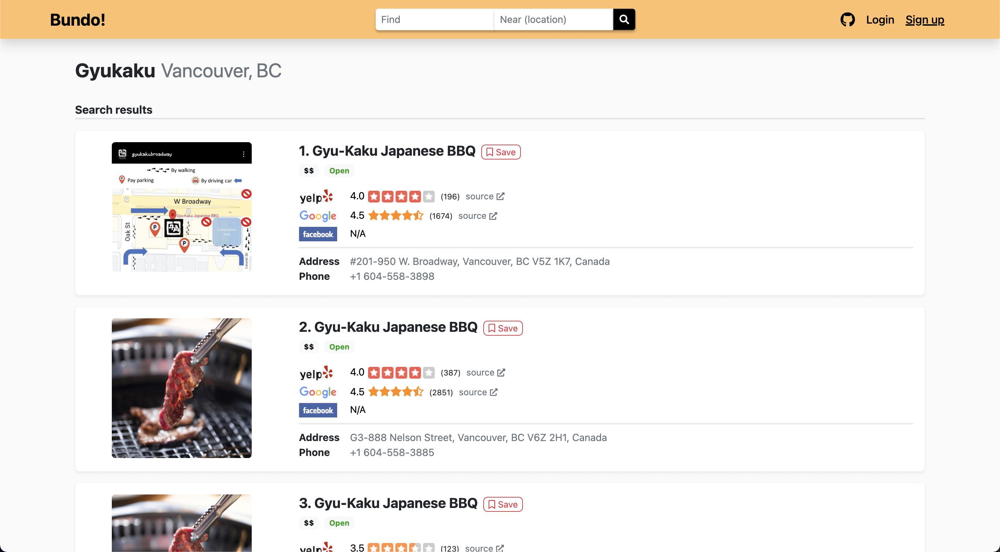

# Bundo!
A Business Review Comparsion Website 

## Overview
**🎁Home page**: https://bundo-reviews.herokuapp.com

Bundo is a business review site that makes comparing business ratings easy and convenient. A business' rating on popular review sites like [Yelp](https://www.yelp.com/), [Google](https://www.google.com/), and [Facebook](https://www.facebook.com/) are bundled and displayed together for a quick, at-a-glance comparsion. This provides a better way to observe crowd-sourced review data from multiple sources, giving a more accurate overview of a business' popularity and quality.

### Screenshots
&nbsp; &nbsp; 

### API Sources
The business and rating data displayed are thanks to the following APIs:

- [**Yelp** Fusion](https://www.yelp.com/developers/documentation/v3/get_started)
- [**Google** Places API](https://developers.google.com/places/web-service/intro?_gac=1.184360532.1591504097.Cj0KCQjwiILsBRCGARIsAHKQWLPLNBTSuEC9M_vYmnENFL500GW7IBsT7XiOFKhnOtvJYH5g8qQcbmMaAm7dEALw_wcB&_ga=2.62337324.145642420.1591504096-1138255556.1589759847)
- [**Facebook** Places Graph API](https://developers.facebook.com/products/places/)

### Architecture
Bundo is a single-page application (SPA) website that's built off of the [MERN](https://www.educative.io/edpresso/what-is-mern-stack) Stack. [Create React App](https://github.com/facebook/create-react-app) was used to bootstrap the frontend and the domain is currently hosted on [Heroku](https://www.heroku.com/).

User authentication is implemented using JSON Web Token. The [bcrypt](https://en.wikipedia.org/wiki/Bcrypt) hashing function, which is based on the [blowfish](https://en.wikipedia.org/wiki/Blowfish_(cipher)) algorithm, is used for encryption.

**Frontend**
- Languages: 
 	* JavaScript
	* HTML
	* CSS
- Main Framework/Libraries:
 	* [React](https://reactjs.org/)
	* [Bootstrap](https://getbootstrap.com/)

**Backend**
- Language: 
	* JavaScript
- Environment:
	* [Node.js](https://nodejs.org/en/)
- Main Framework/Libraries:
 	* [Express.js](https://expressjs.com/)
	* [axios](https://www.npmjs.com/package/axios)
	* [jsonwebtoken](https://www.npmjs.com/package/jsonwebtoken)
	* [bcrypt](https://www.npmjs.com/package/bcrypt)

**Database**
- [MongoDB](https://www.mongodb.com/)
	* [MongoDB Atlas](https://www.mongodb.com/cloud/atlas)
